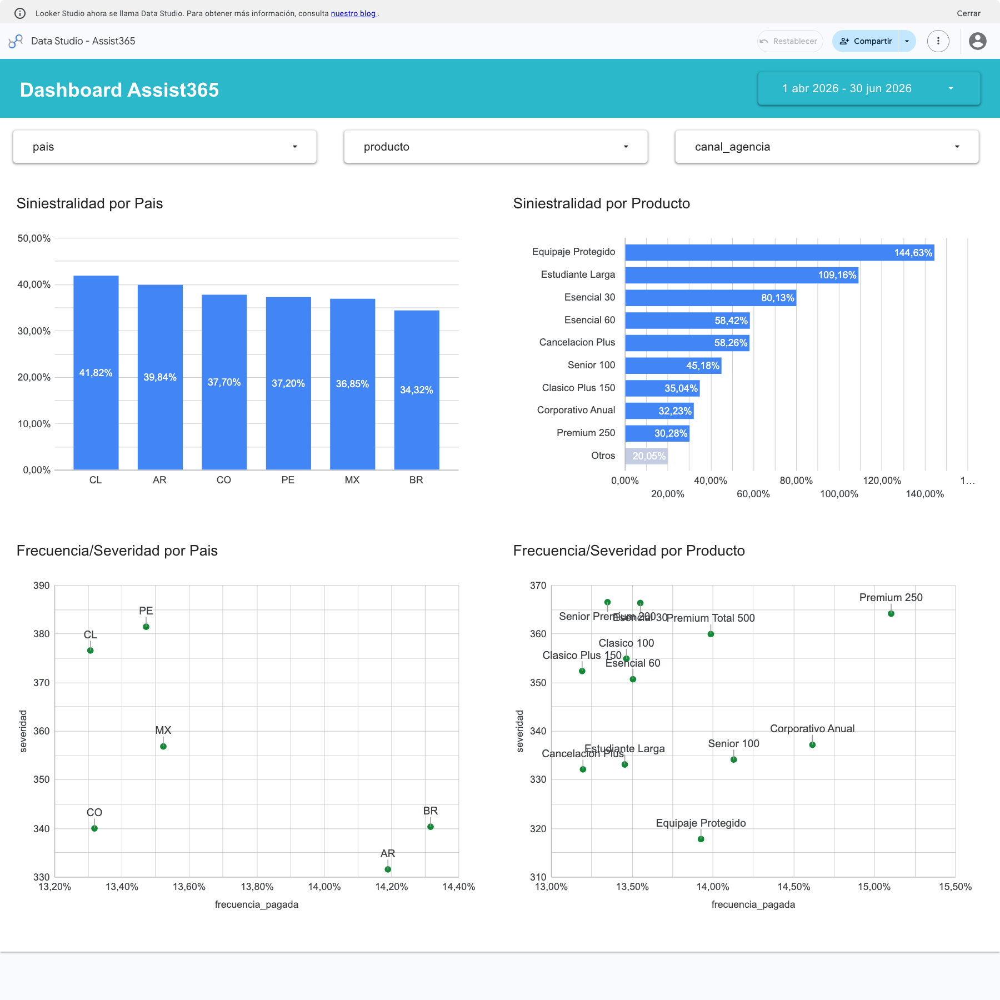

# Dashboard en Looker Studio — cohortes de emisión

[Abrir el dashboard](https://datastudio.google.com/reporting/be1247ad-58d9-4ed1-ba70-ca4830505fb3/page/0eCAG).

El tablero permite comparar países y planes por siniestralidad y analizar si las diferencias se relacionan con frecuencia de eventos pagados, costo promedio o prima media. Está construido sobre `a365-de-ignacio.assist365_mart.dashboard_diario`, una tabla física mensual de **45.875 filas y 15,21 MB**. [Esquema y reglas de gold](../../README.md#capa-gold).

[](https://datastudio.google.com/reporting/be1247ad-58d9-4ed1-ba70-ca4830505fb3/page/0eCAG)

Vista del tablero para **abril–junio de 2026**. Abrir el enlace para cambiar el período o aplicar filtros; la imagen es una referencia estática.

## Archivos y uso

| Archivo o recurso | Situación de ejemplo | Qué permite hacer |
|---|---|---|
| [Dashboard](https://datastudio.google.com/reporting/be1247ad-58d9-4ed1-ba70-ca4830505fb3/page/0eCAG) | Se quieren comparar países, planes o canales. | Consultar indicadores con gráficos y filtros, leyendo la tabla gold. |
| [dashboard-preview.png](assets/dashboard-preview.png) | Se revisa la entrega sin abrir Looker. | Ver una captura de referencia para abril–junio de 2026; no cambia con los filtros. |
| [001_medir_consumo.sql](sql/001_medir_consumo.sql) | Se abrió el dashboard y se quiere saber cuántos datos leyeron sus consultas. | Consultar los jobs identificados como Looker dentro de una ventana de tiempo y sumar sus bytes procesados. |
| [consumo_20260930.json](evidence/consumo_20260930.json) | Se quiere revisar cómo se obtuvo la medición entregada. | Consultar las ventanas, consultas, IDs de jobs y resultados registrados; es evidencia guardada, no una nueva medición. |

## Período y filtros

La fecha `date` es el primer día del mes de emisión de las pólizas. Seleccionar una cohorte incluye su prima y sus siniestros elegibles posteriores, acumulados hasta el corte de ocurrencia **29/09/2026**. No representa pagos realizados durante el trimestre seleccionado.

El tablero abre en **01/04/2026–30/06/2026**. El selector de fechas permite cambiar el período y los filtros de país, producto y canal de agencia delimitan la población analizada. `producto` es el nombre del plan y `canal_agencia` proviene del catálogo de agencias.

Gold conserva además `tipo_producto`, `es_premium` y `canal_origen` para ampliar el análisis. El canal de origen pertenece a la póliza y no es intercambiable con el canal de agencia. `day` y `day_of_week` describen el primer día del mes, no días reales de emisión u ocurrencia.

## Preguntas y visualizaciones

| Pregunta | Visualización | Interpretación |
|---|---|---|
| ¿Qué país está peor este trimestre? | Columnas por `pais`. | Siniestralidad en orden descendente. El mayor ratio indica peor relación observada entre costo pagado y prima informada. |
| ¿Qué plan destruye margen? | Barras horizontales por `producto`. | Siniestralidad descendente. Un ratio superior al 100% indica que el costo pagado supera la prima; no demuestra margen neto porque faltan otros gastos y prima devengada. |
| ¿El problema es frecuencia o monto promedio? | Dispersión por país o plan. | Dos gráficos, uno por país y otro por plan. Eje X: frecuencia pagada; eje Y: severidad USD. A la derecha hay más eventos por póliza; arriba, eventos más caros; arriba y a la derecha, ambos componentes elevados. |

Los conteos de gold se agregan mediante **SUM**: COUNT contaría filas del mart, no pólizas ni siniestros.

## Indicadores

Las métricas dividen sumas para conservar la ponderación al cambiar filtros o agrupaciones.

**Siniestralidad**, tipo Porcentaje:

```text
SUM(costo_pagado_usd) / SUM(prima_usd)
```

**Frecuencia pagada**, tipo Porcentaje:

```text
SUM(siniestros_pagados_con_costo_usd) / SUM(polizas)
```

**Severidad USD**, tipo Moneda USD:

```text
SUM(costo_pagado_usd) / SUM(siniestros_pagados_con_costo_usd)
```

La frecuencia mide eventos, no pólizas afectadas: 15 pagos sobre 100 pólizas son 15 eventos cada 100 pólizas. Si cuestan USD 6.000, la severidad es USD 400 por evento. Ambas métricas usan los mismos eventos PAGADO con costo USD válido.

La **prima media USD** es `SUM(prima_usd) / SUM(polizas)`. La relación `siniestralidad = frecuencia × severidad / prima media` explica por qué una prima baja puede producir un ratio alto sin frecuencia ni severidad elevadas. Un denominador cero significa indicador sin valor.

Siniestralidad y frecuencia se muestran como **porcentajes** con dos decimales; severidad, como **USD por evento**. El ratio `0,3817` representa `38,17%`, sin multiplicar por 100 en la fórmula.

[Glosario, fundamento de frecuencia/severidad y ejemplo numérico](../../README.md#glosario-y-fundamento-de-las-métricas).

## Ejemplo de lectura — abril–junio de 2026

Los [resultados de las dos queries de análisis](../parte_05_analisis/README.md#ejemplo-de-análisis-tres-trimestres-de-emisión) dan ejemplos para el mismo período y corte:

- Chile presenta la mayor siniestralidad observada: **41,82%**, frente a **38,17%** de la cartera.
- Equipaje Protegido alcanza **144,63%**. Su prima media es USD 30,59 frente a USD 125,64 general; el ratio elevado no se explica por frecuencia o severidad especialmente altas.
- ONLINE en Chile llega a **65,15%**, con **17,03 eventos pagados cada 100 pólizas** y **USD 464,33 por evento**, frente a 11,44 y USD 334,05 en CALL_CENTER. En este segmento, frecuencia y severidad acompañan la diferencia.

La categoría “Otros” del gráfico de productos agrupa los planes restantes; no representa un plan individual. Las comparaciones son descriptivas y no demuestran causalidad: deben considerarse la mezcla de planes, los canales y el tamaño de cada población. Para comparar premium y no premium, utilizar productos del mismo `tipo_producto`.

## Tratamiento de datos y límites

Gold excluye pólizas D/ausentes/ANULADA y sus eventos, y retira negativos y casos monetarios no resolubles de importes y conteos. La moneda inferida válida se incluye. La falta de coincidencia de cobertura se clasifica aparte; existen medidas `*_con_periodo`. [Tratamiento y alcance](../../README.md#anomalías-y-tratamiento).

**Las cohortes recientes pueden seguir acumulando siniestros y pagos.** La prima es la última informada, no prima devengada ni cobro comprobado. El corte limita ocurrencia; no reconstruye estados históricos ni fechas de pago.

## Medición de consumo

**Carga inicial medida: 1.405.616 bytes procesados = 1,405616 MB**, por debajo de **50.000.000 bytes**. Medición del 30/09/2026, con el snapshot entregado y rango 01/04/2026–30/06/2026. MB se expresa en unidades decimales: 1 MB = 1.000.000 bytes.

Se abrió el dashboard en Chrome con una sesión aislada, se registró la ventana UTC y se consultó `INFORMATION_SCHEMA.JOBS_BY_PROJECT`, filtrando `requestor=looker_studio` y el ID del reporte. Se sumó `total_bytes_processed` de todos los jobs de esa apertura. Las consultas de auditoría no llevan esas etiquetas y no entran en el total. [Identificación oficial de jobs del conector](https://docs.cloud.google.com/data-studio/bigquery-monitor).

| Consulta de la carga inicial | Bytes procesados |
|---|---:|
| Siniestralidad por país | 189.244 |
| Siniestralidad por producto | 242.264 |
| Frecuencia/severidad por país | 189.244 |
| Frecuencia/severidad por producto | 242.264 |
| Categoría “Otros” del gráfico de productos | 242.264 |
| Control de país | 51.612 |
| Control de producto | 139.040 |
| Control de canal de agencia | 109.684 |
| **Total: ocho consultas** | **1.405.616** |

No hubo aciertos de caché BigQuery ni errores en esta carga. El SQL emitido incluye el filtro de fechas; el conector consulta solo las columnas necesarias del mart mensual, sin leer hechos completos ni JSON. Por eso el escaneo real es menor que multiplicar el tamaño de la tabla por cuatro.

Se probaron los tres filtros por separado, restableciendo la selección anterior y manteniendo el mismo trimestre. Cada fila siguiente representa **una interacción**, no una carga acumulada de toda la sesión:

| Escenario | Jobs emitidos | Bytes procesados | MB procesados |
|---|---:|---:|---:|
| Apertura inicial, sin filtros comerciales | 8 | 1.405.616 | 1,405616 |
| Seleccionar país CL | 7 | 1.440.024 | 1,440024 |
| Seleccionar canal ONLINE | 7 | 1.582.008 | 1,582008 |
| Seleccionar Equipaje Protegido | 6 | 1.305.208 | 1,305208 |

Todas las consultas observadas finalizaron correctamente, sin caché BigQuery. El máximo entre las pruebas fue **1,58 MB**, el **3,16% del límite**. La cantidad de jobs varía con la interacción y la reutilización de resultados del conector; no se asume una query por gráfico.

**Escaneo y facturación son distintos.** La carga inicial registró 83.886.080 bytes facturados por los mínimos por consulta; eso no representa bytes adicionales escaneados. Para verificar el requisito del ejercicio se utiliza `total_bytes_processed`, conservando también `total_bytes_billed` en la evidencia. [Reglas de facturación de BigQuery](https://cloud.google.com/bigquery/pricing).

### Reproducir

La [evidencia JSON](evidence/consumo_20260930.json) conserva ventanas UTC, IDs de jobs, SQL real, bytes y caché. La [query de medición](sql/001_medir_consumo.sql) devuelve el total y el detalle para la ventana inicial:

```bash
bq --project_id=a365-de-ignacio --location=us-central1 query \
  --use_legacy_sql=false --format=json --maximum_bytes_billed=1073741824 \
  < scripts/parte_06_tablero/sql/001_medir_consumo.sql
```

Para repetir la prueba, registrar inicio/fin UTC de una carga aislada y cambiar esas fechas en el SQL. Se requiere visibilidad de los jobs del proyecto; evitar otras sesiones del mismo reporte durante esa ventana y esperar su finalización. Si no aparecen jobs, puede haber caché del conector: la query devuelve `SIN_JOBS_OBSERVADOS`, que no prueba por sí solo el consumo sin caché. La medición depende de la configuración, los datos y el período; revalidar tras modificarlos. Los jobs históricos están sujetos a la retención de BigQuery; el JSON preserva la evidencia entregada.
